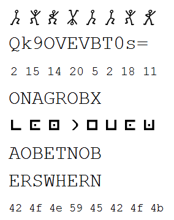

# 07 - Crypto for Rookies

> This crypto is not hard to crack.
> 
> 


Solving the different ciphers, and taking the odd char out from each (keeping its position), we get the final solution "CAPYBARA":

```
(Dancing men image)      : BOKTBBOK (dancing men)
Qk9OVEVBT0s=             : BONTEAOK (base64)
02 15 14 20 05 02 18 11  : BONTEBRK (alphabet position)
ONAGROBX                 : BANTEBOK (rot13)
(Pigben cipher image)    : CONTEBOK (pigpen)
AOBETNOB                 : BONTEBOA (reverse)
ERSWHERN                 : BOPTEBOK (shift -3)
42 4f 4e 59 45 42 4f 4b  : BONYEBOK (hex)
                           ||||||||
                         : CAPYBARA
``` 